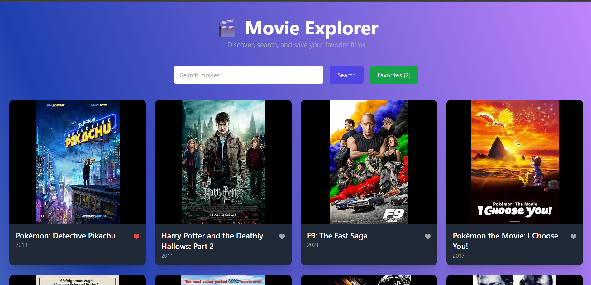
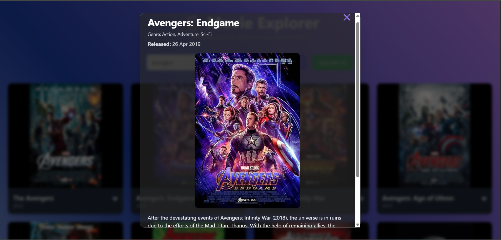

# 🎬 Movie Explorer

A React-based movie search and favorites app that lets you discover, search, and save your favorite films.  
Powered by the OMDb API and styled with Tailwind CSS, featuring smooth animations, responsive design, and glassmorphism UI.

---

## 📸 Screenshots

  
*Movie list and search interface*

  
*Detailed movie information modal with glassmorphism design*

---

## 💻 Tech Stack

- **React** — Frontend UI library for building interactive user interfaces  
- **Tailwind CSS** — Utility-first CSS framework for rapid styling  
- **JavaScript (ES6+)** — Programming language for logic and functionality  
- **OMDb API** — The Open Movie Database API used for fetching movie data  
- **Git & GitHub** — Version control and project hosting

---

## ⚙️ Features

- Search movies by keyword  
- View detailed movie information in a modal  
- Add/remove movies to/from favorites  
- Pagination support for search results  
- Responsive design for all screen sizes  
- Animated UI with smooth transitions  
- Glassmorphism styling for movie details section  

---

## 🔗 API

This app uses the [OMDb API](http://www.omdbapi.com/) for movie data.
